(Developer: Slava Kondriianenko)

The website represents three pages with Guess a Number game, Quiz about math and contact form which send an email to site owner.

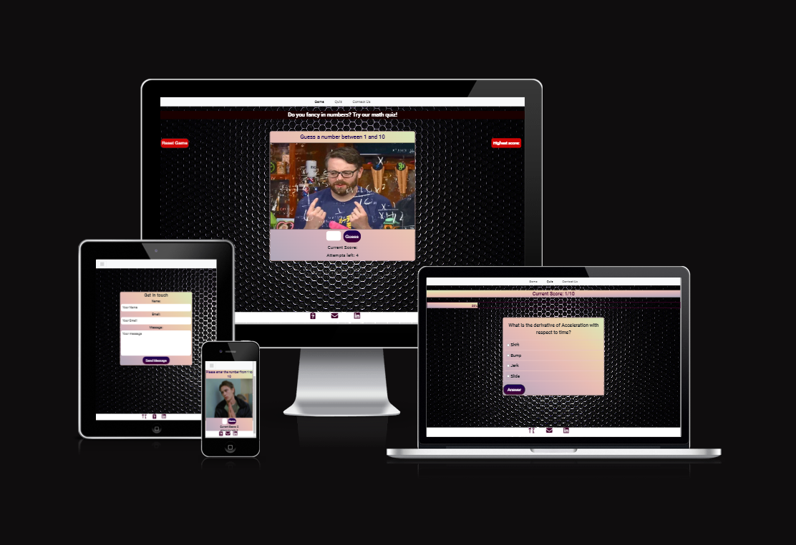

[Live website](https://viacheslav1510.github.io/Portfolio_Project_2-Guess_game-Math_quiz/)

## Table of Content
- [Table of Content](#table-of-content)
- [Project Goals](#project-goals)
  - [User Goals](#user-goals)
  - [Site Owner Goals](#site-owner-goals)
- [User Experience](#user-experience)
  - [Target Audience](#target-audience)
  - [User Requirements and Expectations](#user-requirements-and-expectations)
  - [User Stories](#user-stories)
    - [First-time User](#first-time-user)
    - [Returning User](#returning-user)
    - [Site Owner](#site-owner)
- [Design](#design)
  - [Design Choices](#design-choices)
  - [Colour](#colour)
  - [Font](#font)
  - [Structure](#structure)
  - [Wireframes](#wireframes)
- [Technologies Used](#technologies-used)
  - [Languages](#languages)
  - [Frameworks, Libraries \& Tools](#frameworks-libraries--tools)
- [Features](#features)
  - [Guess a Number game page](#guess-a-number-game-page)
    - [Page loaded](#page-loaded)
    - [Game started](#game-started)
  - [Quiz game](#quiz-game)
    - [Page loaded](#page-loaded-1)
    - [User started quiz](#user-started-quiz)
    - [Quiz finished](#quiz-finished)
  - [Contact page](#contact-page)
    - [Page loaded](#page-loaded-2)
    - [Submitted message](#submitted-message)
  - [Footer](#footer)
- [Validation](#validation)
  - [HTML Validation](#html-validation)
  - [CSS Validation](#css-validation)
  - [JavaScript Validation](#javascript-validation)
  - [Accessibility](#accessibility)

## Project Goals
### User Goals
- Have fun playing the Guess a Number game
- Pass the math test and get the highest possible score
- Contact developer to suggest an idea or get feedback
### Site Owner Goals
- Entertain the website user
- Find an interested client for further site development
- Allow the user to contact the developer

## User Experience
### Target Audience
- People who want to have fun
- Developers who want to get an idea for their projects
- Customers who want to find a developer for their product
### User Requirements and Expectations
- Great interactive content that will make the customer think about hire a developer
- Intuitive navigation which will help you navigate the site easily
- A pleasant design that will make the user stay on the site
- An easy way to contact the site owner

### User Stories
#### First-time User 
1. As a first time user I want to understant what this site about
2. As a first time user I want to play interactive game
3. I want program to memorize my high score
4. I want play game as many times as i want
5. As a first time user I want to navigate easily between pages
6. I want to pass quiz and get the highest possible score
7. As a first time user I want to see quiz progress
8. I want to contact the website owner
#### Returning User
9. As a a returning user I want to play game again
10. As a a returning user I want to make my best on quiz
11. I want to contact site owner and get feedback
12. As a a returning user I want to find developer on social media
#### Site Owner
13. As the site owner I want users to easy find what this website about
14. As the site owner I want to interest the user in my games
15. As the site owner I want users to contact me easily

## Design
### Design Choices
The design across the pages was kept simple and consistent. Background presented with Background image and main container background was taken from [mycolor.space - color palettes](https://mycolor.space/)
### Colour 
Red color chosen to math reset game button and highlight the high score. Maroon color chosen for buttons and footer navigation. Color palette gradient was chosen for main game bakcground and quiz progress bar. To narrow down the colours I used Adobe Color. 
 
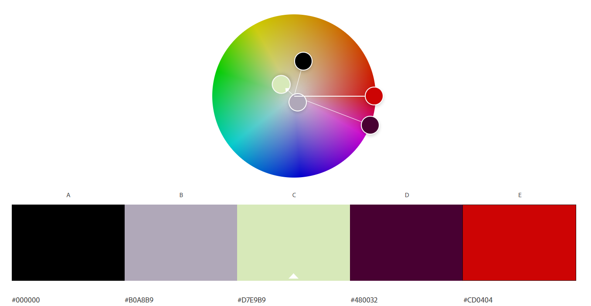

### Font
Google Fonts were implemented on the website. Roboto with sans-serif fallback was used across all screens as I found it highly readable and clear.
### Structure
The pages is structured in a well know, recognizable, user friendly, and easy to learn way. Each screen of the website appears in the similar containers with maintained harmony of all elements within.
The website cosists of three separate pages:
- First page / Guess a Number game:
  - Game main section with changable message, GIF animation, input for number and Guess button for check answer
  - Current score and Attempts left labels under the Guess button
  - Reset game button and Highest score label above main section
  - Footer with links for Quiz, Contact form and link for social media Linkedin
- Second page / Math Quiz:
  - Maing section with questions, four answer variants and button for answer
  - Current score label and progress bar above main section
  - Footer with links to Guess a Number game, Contact form and link for social media Linkedin
- Third page / Contact form:
  - Maing section with name, email and message input. Button Send Message under the message text area
  - Footer with links to Guess a Number game, Quiz and link for social media Linkedin
### Wireframes

Big Screens

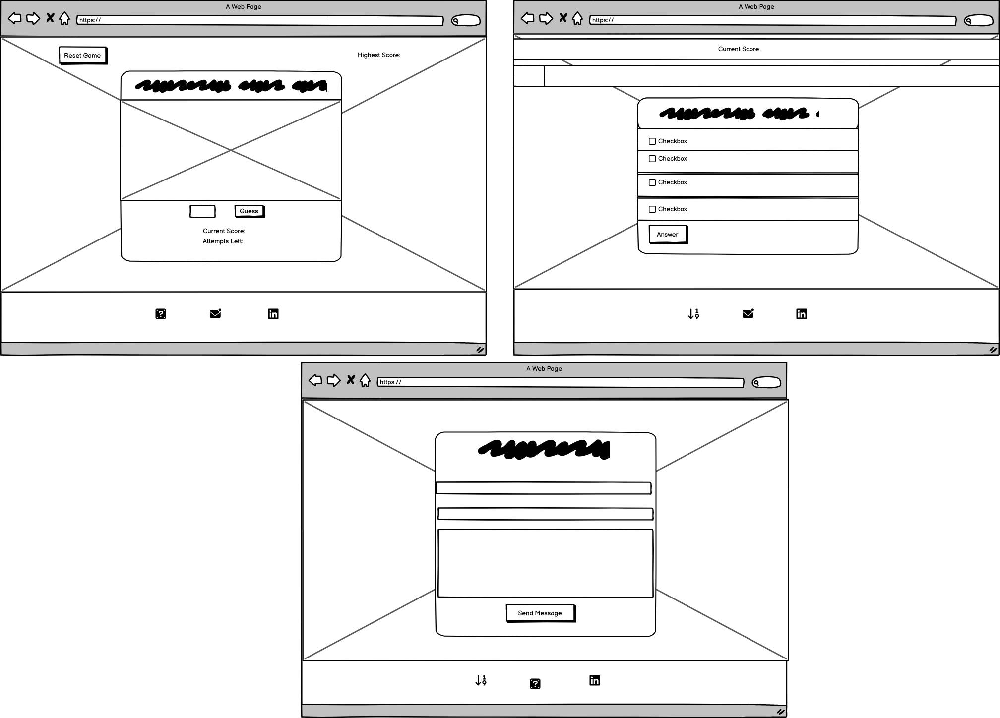

Medium screens - tablets

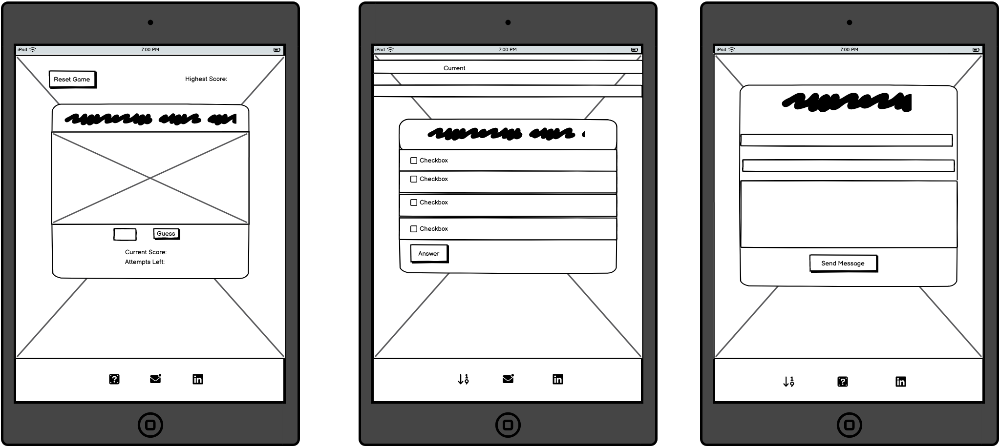

Small screens - mobile

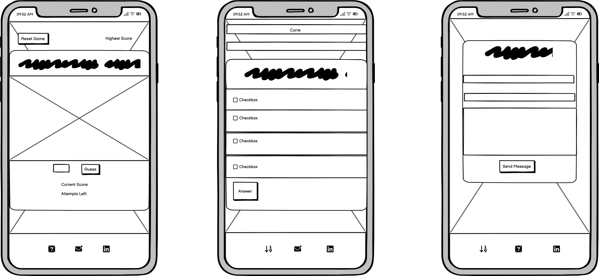

## Technologies Used
### Languages
- HTML
- CSS
- JavaScript
### Frameworks, Libraries & Tools
- [Am I Responsive](https://ui.dev/amiresponsive) was used to create the multi-device mock-up you can see at the start of this README.md file
- [ColorSpace](mycolor.space) - used to make background palette for main containers
- [Balsamiq](https://balsamiq.com/) to create the wireframes for the project
- [Font Awesome](https://fontawesome.com/) - Icons from Font Awesome were used for footer icons
- [Favicon.io](https://favicon.io) for making the site favicon
- [GIPHY - Be Animated](https://giphy.com/) - Was used for Guess a Number game main images
- [Google Fonts](https://fonts.google.com/)
- Microsoft Paint was used to create pictures for docs
- [Walpapers Platform](https://wallpaperset.com/) was used for background image
- [gitpod.io](https://www.gitpod.io/) was used for coding and to push the code to GitHub
- [GitHub](https://github.com/) was used as a remote repository to store project code
- [Chrome dev tools](https://developers.google.com/web/tools/chrome-devtools) were used for debugging of the code and check site for responsiveness
- [WC3 Validator](https://validator.w3.org/), [Jigsaw W3 Validator](https://jigsaw.w3.org/css-validator/), [JShint](https://jshint.com/), [Wave Validator](https://wave.webaim.org/), [Lighthouse](https://developers.google.com/web/tools/lighthouse/) and [Am I Responsive](http://ami.responsivedesign.is/) were all used to validate the website

## Features
The website has 3 webpages
### Guess a Number game page
#### Page loaded
  - When the page is loaded you can see title what this game about
  - The user has input field and guess button to play. User is asked to enter their
  guess in numbers  
  - The user can refresh the game with refresh button
  - The user can see attempts left, current score and highest score labels
  - User stories covered: 1, 9, 13.

See feature

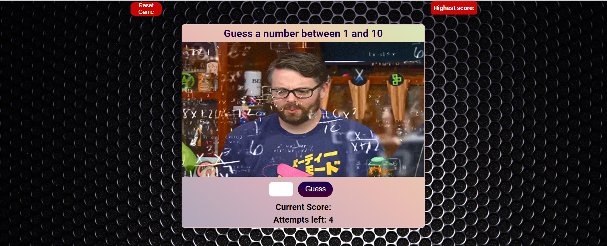

#### Game started
  - Depends to user input program checks is it copares to guess number and changes title GIF and message.
  - With each input program decreases attempts left and current score
  - Program memorize highest score and shows it in "Highest score" label
  - User can reset the game and start to beat their score.
  - User stories covered: 2, 3, 4, 9

See feature

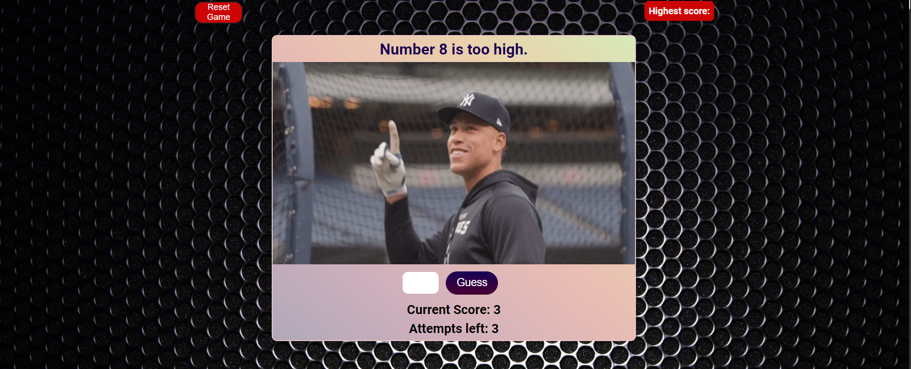
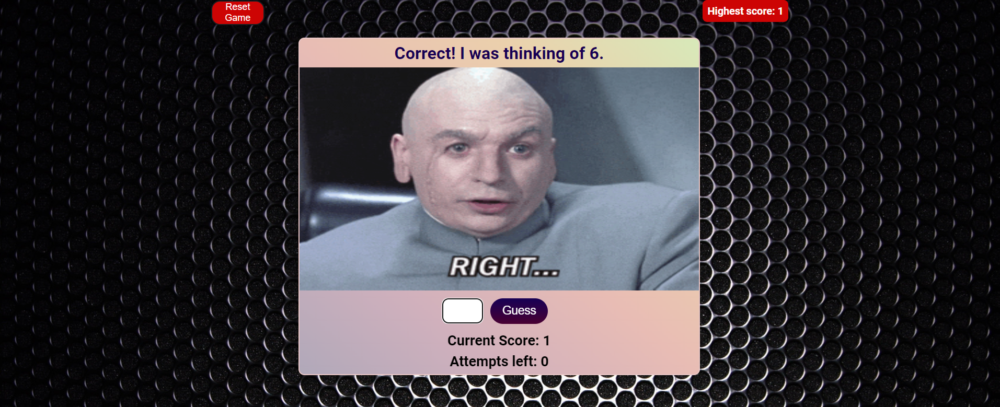

### Quiz game
#### Page loaded
  - Main quiz container shows random answer and four answer options
  - User can choose answer radio button submit it with "Answer" button
  - Webpage shows current score on the top of the page
  - Progress bar under current score is clear before first answer
  - User stories covered: 6

See feature

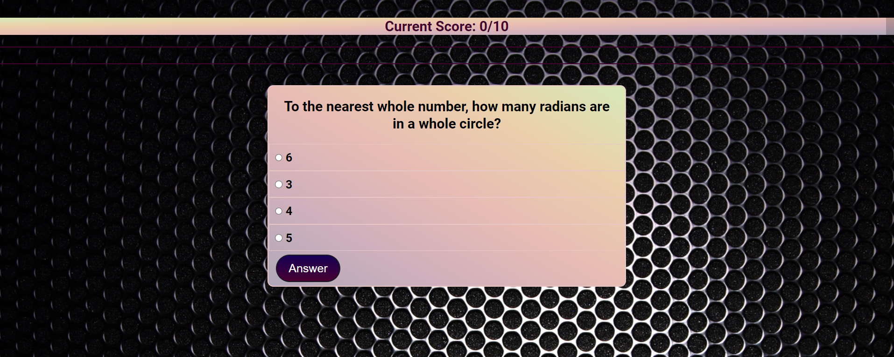

#### User started quiz
  - Main quiz container shows another questions
  - Progress bar start fill up
  - Current score changes when answer is right
  - User stories covered: 7

See feature

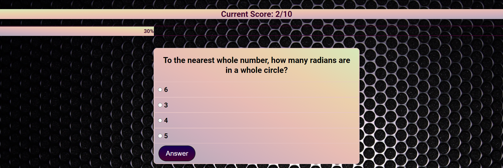

  

#### Quiz finished
  - User can see their finish score
  - User receives message about their progress and have oportunity to pass quiz again with "Play Again" button
  - Progress bar is filled up to 100%
  - User stories covered: 6, 10

See feature

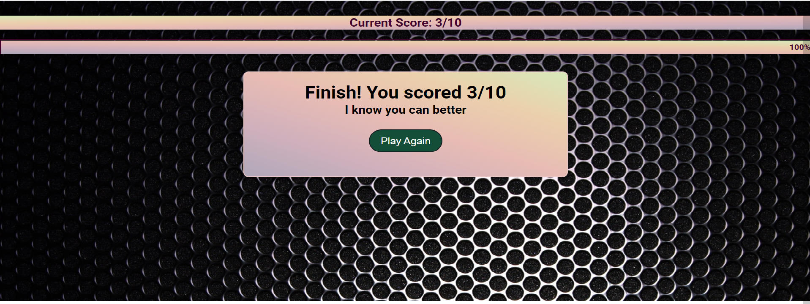

### Contact page
#### Page loaded
  - When page loaded user can see contact form with name input, email input and message textarea
  - All inputs have to be filled up
  - Message button submit user inputs
  - Site owner receives user meassage on his email
  - User stories covered: 8, 15

See feature

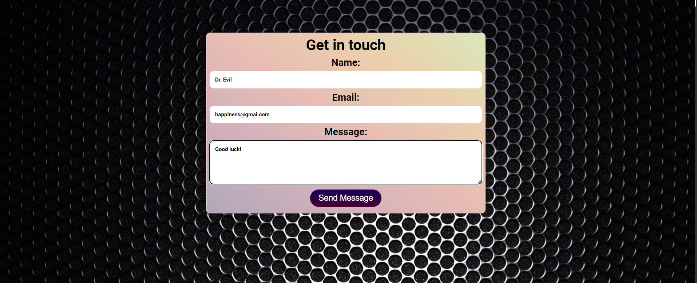

#### Submitted message
  - When user send message they receive status notification
  - If submit successful user see "Thank You" gif and have opportunity to send another message
  - User stories covered: 11

See feature

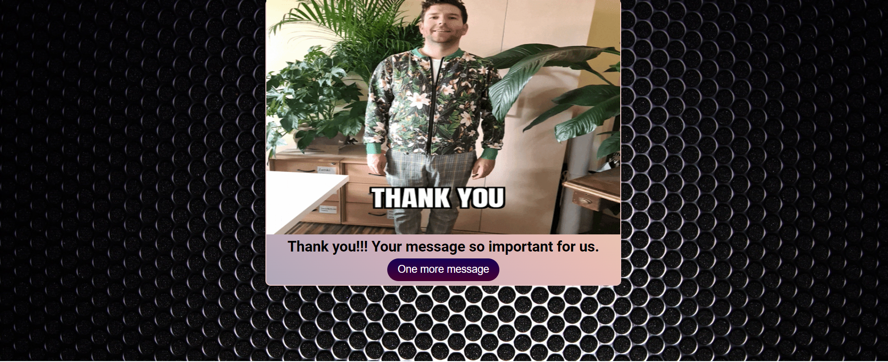

### Footer
  - Footer links help user to navigate through website
  - Every page has Linkedin social media link and another two links are different
  - User stories covered: 5, 12

Guess footer

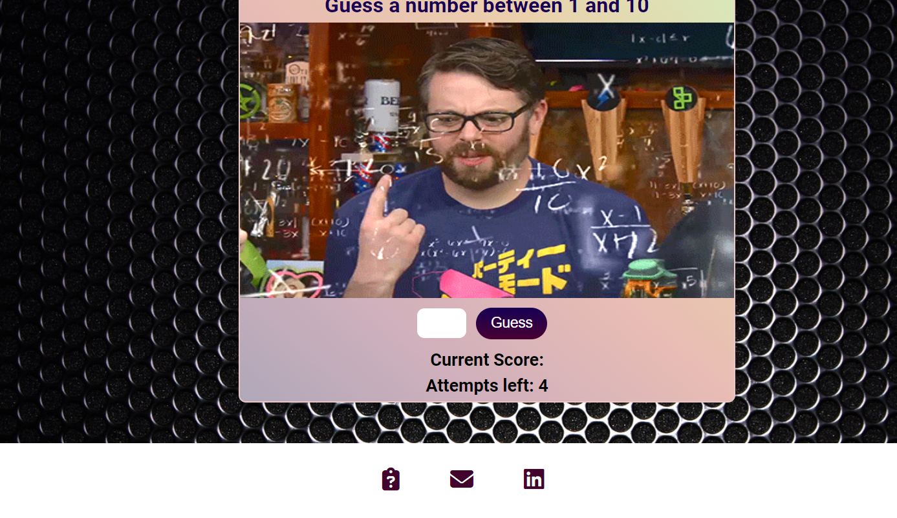

Quiz footer

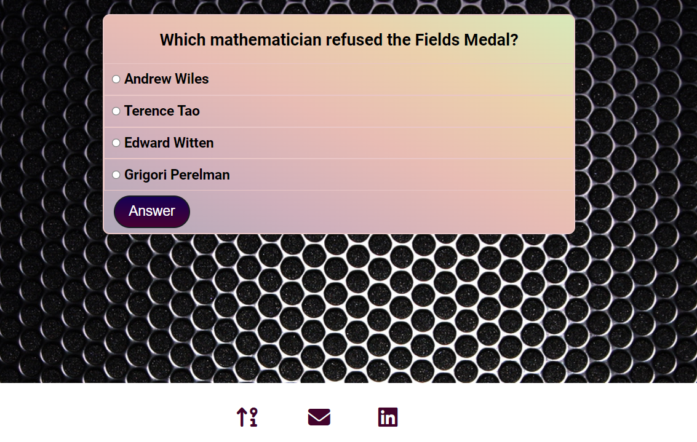

Contact footer

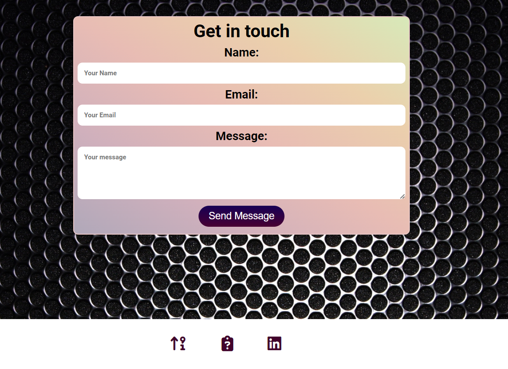

## Validation
### HTML Validation
Tested HTML code with [W3C Validator](https://validator.w3.org/). Passed with no errors. 

Guess page

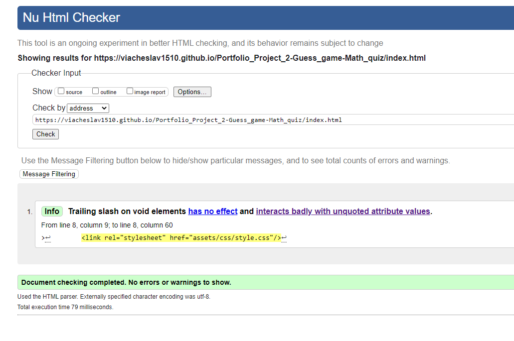

Quiz page

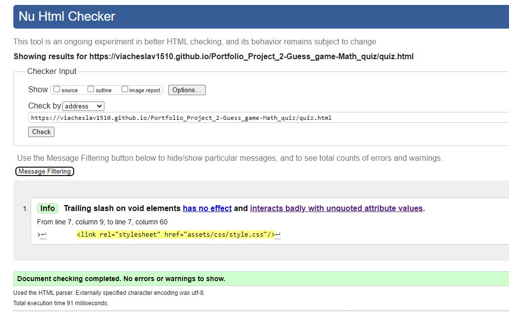

HTML validation for contact page shows two warnings about JavaScript type attribute , but I didn't want to change it because this script was taken from EmailJS documentation.

Contact page

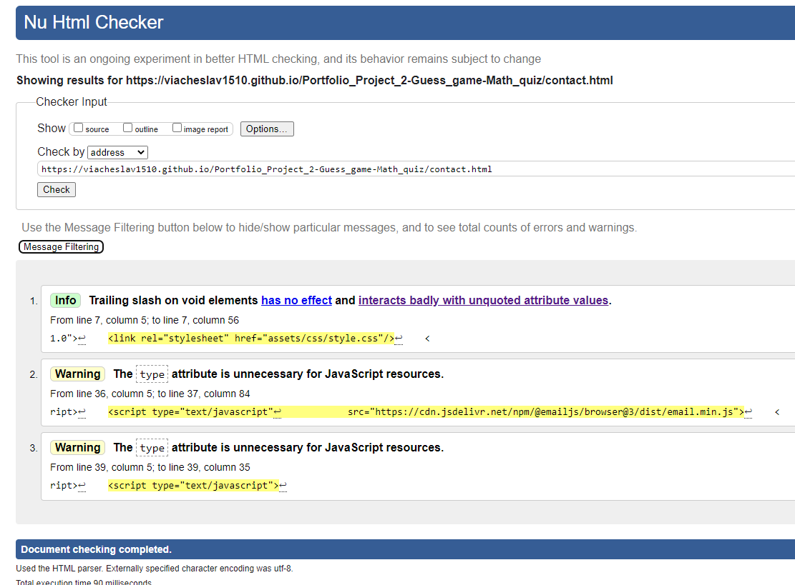

### CSS Validation
Tested CSS code with [W3C Jigsaw CSS Validation Service](https://jigsaw.w3.org/css-validator/). Passed with no errors.

All site

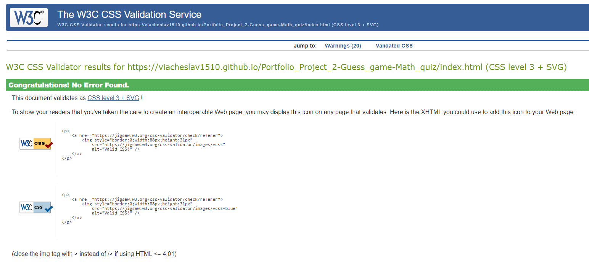

### JavaScript Validation
[JSHint](https://jshint.com/) JS Validation Service was used to validate the Javascript files. Passed with no errors.

guess.js

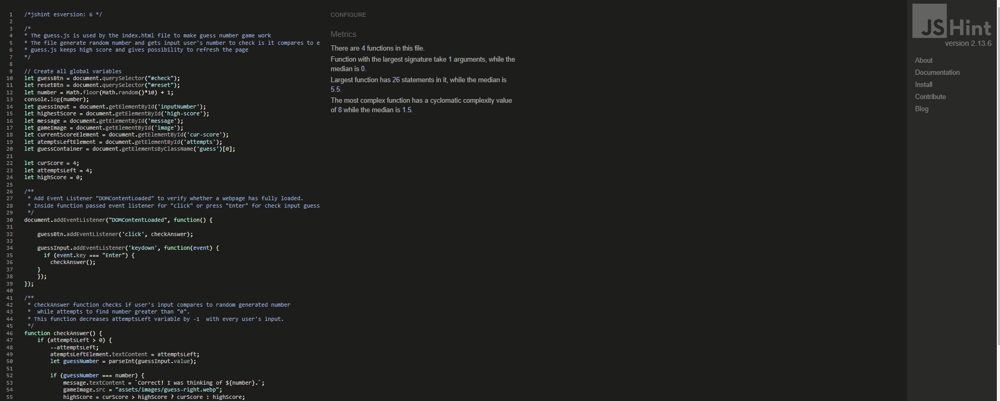

quiz-code.js

contact.js

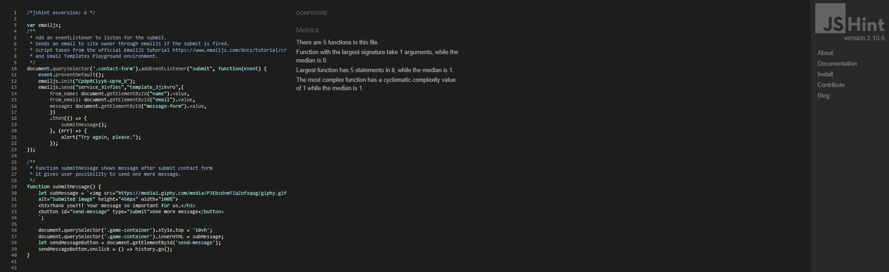

### Accessibility
[Wave Validator](https://wave.webaim.org/) web accessibility evaluation tool was used to ensure the website met high accessibility standards.

Home

