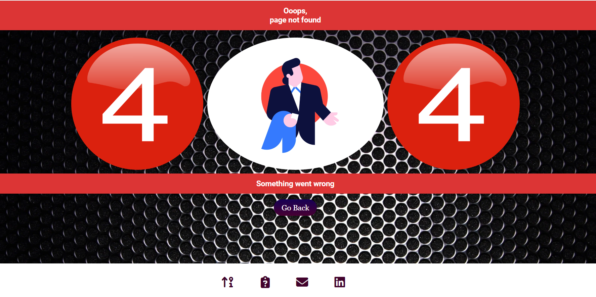
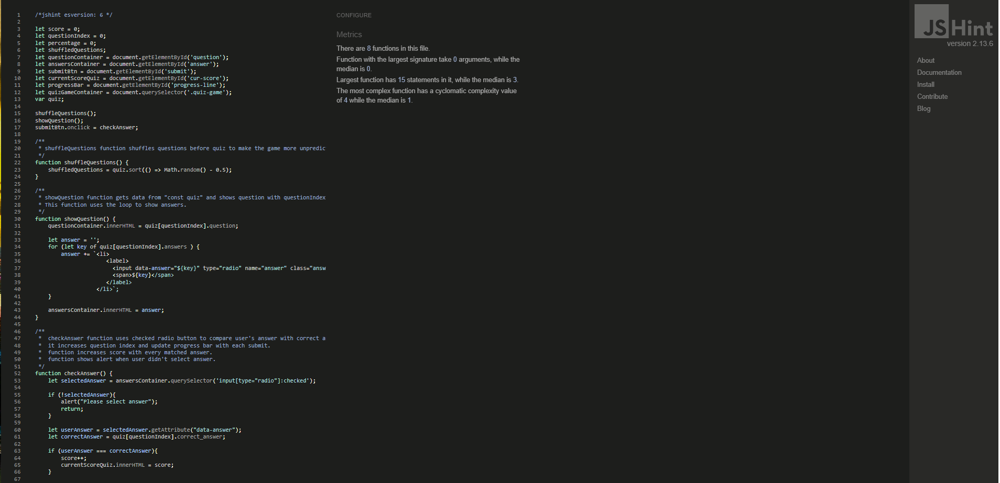
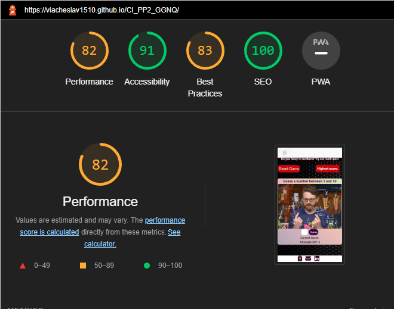
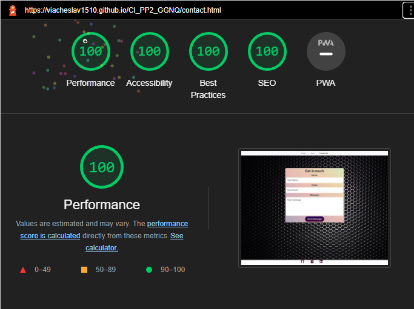
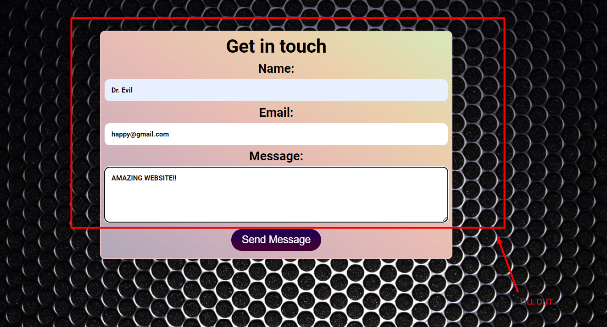
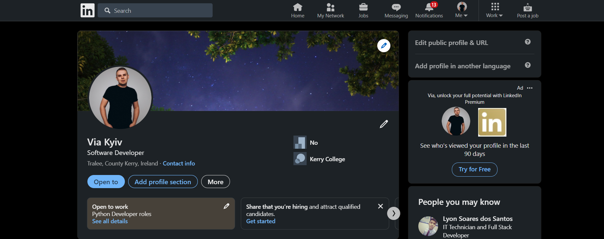

(Developer: Slava Kondriianenko)

The website represents three pages with Guess a Number game, Quiz about math and contact form which send an email to site owner.

[Live website](https://viacheslav1510.github.io/CI_PP2_GGNQ/)

## Table of Content
- [Table of Content](#table-of-content)
- [Project Goals](#project-goals)
  - [User Goals](#user-goals)
  - [Site Owner Goals](#site-owner-goals)
- [User Experience](#user-experience)
  - [Target Audience](#target-audience)
  - [User Requirements and Expectations](#user-requirements-and-expectations)
  - [User Stories](#user-stories)
    - [First-time User](#first-time-user)
    - [Returning User](#returning-user)
    - [Site Owner](#site-owner)
- [Design](#design)
  - [Design Choices](#design-choices)
  - [Colour](#colour)
  - [Font](#font)
  - [Structure](#structure)
  - [Wireframes](#wireframes)
- [Technologies Used](#technologies-used)
  - [Languages](#languages)
  - [Frameworks, Libraries \& Tools](#frameworks-libraries--tools)
- [Features](#features)
  - [Guess a Number game page](#guess-a-number-game-page)
    - [Page loaded](#page-loaded)
    - [Game started](#game-started)
  - [Quiz game](#quiz-game)
    - [Page loaded](#page-loaded-1)
    - [User started quiz](#user-started-quiz)
    - [Quiz finished](#quiz-finished)
  - [Contact page](#contact-page)
    - [Page loaded](#page-loaded-2)
    - [Submitted message](#submitted-message)
  - [Footer](#footer)
  - [404 error page](#404-error-page)
- [Validation](#validation)
  - [HTML Validation](#html-validation)
  - [CSS Validation](#css-validation)
  - [Accessibility](#accessibility)
    - [Alerts](#alerts)
  - [JavaScript Validation](#javascript-validation)
  - [Performance](#performance)
  - [Browser compatibility](#browser-compatibility)
- [Testing user stories](#testing-user-stories)
- [Bugs](#bugs)
- [Deployment \& Local Development](#deployment--local-development)
  - [Deployment](#deployment)
  - [How to Fork this GitHub Repository](#how-to-fork-this-github-repository)
  - [How to Clone this GitHub Repository](#how-to-clone-this-github-repository)
- [Credits](#credits)
  - [Code](#code)
  - [Media](#media)
- [Acknowledgements](#acknowledgements)

## Project Goals
### User Goals
- Have fun playing the Guess a Number game
- Pass the math test and get the highest possible score
- Contact developer to suggest an idea or get feedback
### Site Owner Goals
- Entertain the website user
- Find an interested client for further site development
- Allow the user to contact the developer

## User Experience
### Target Audience
- People who want to have fun
- Developers who want to get an idea for their projects
- Customers who want to find a developer for their product
### User Requirements and Expectations
- Great interactive content that will make the customer think about hire a developer
- Intuitive navigation which will help you navigate the site easily
- A pleasant design that will make the user stay on the site
- An easy way to contact the site owner

### User Stories
#### First-time User 
1. As a first time user I want to understant what this site about
2. As a first time user I want to play interactive game
3. I want program to memorize my high score
4. I want play game as many times as i want
5. As a first time user I want to navigate easily between pages
6. I want to try another game
7. I want to pass quiz and get the highest possible score
8. As a first time user I want to see quiz progress
9. I want to contact the website owner
#### Returning User
10. As a a returning user I want to play game again
11. As a a returning user I want to make my best on quiz
12. I want to contact site owner and get feedback
13. As a a returning user I want to find developer on social media
#### Site Owner
14. As the site owner I want users to easy find what this website about
15. As the site owner I want to interest the user in my games
16. As the site owner I want users to contact me easily

## Design
### Design Choices
The design across the pages was kept simple and consistent. Background presented with Background image and main container background was taken from [mycolor.space - color palettes](https://mycolor.space/)
### Colour 
Red color chosen to math reset game button and highlight the high score. Maroon color chosen for buttons and footer navigation. Color palette gradient was chosen for main game bakcground and quiz progress bar. To narrow down the colours I used Adobe Color. 
 

### Font
Google Fonts were implemented on the website. Roboto with sans-serif fallback was used across all screens as I found it highly readable and clear.
### Structure
The pages is structured in a well know, recognizable, user friendly, and easy to learn way. Each screen of the website appears in the similar containers with maintained harmony of all elements within.
The website cosists of three separate pages:
- First page / Guess a Number game:
  - Game main section with changable message, GIF animation, input for number and Guess button for check answer
  - Current score and Attempts left labels under the Guess button
  - Reset game button and Highest score label above main section
  - Footer with links for Quiz, Contact form and link for social media Linkedin
- Second page / Math Quiz:
  - Maing section with questions, four answer variants and button for answer
  - Current score label and progress bar above main section
  - Footer with links to Guess a Number game, Contact form and link for social media Linkedin
- Third page / Contact form:
  - Maing section with name, email and message input. Button Send Message under the message text area
  - Footer with links to Guess a Number game, Quiz and link for social media Linkedin
### Wireframes

Big Screens

Medium screens - tablets

Small screens - mobile

## Technologies Used
### Languages
- HTML
- CSS
- JavaScript
### Frameworks, Libraries & Tools
- [Am I Responsive](https://ui.dev/amiresponsive) was used to create the multi-device mock-up you can see at the start of this README.md file
- [ColorSpace](mycolor.space) - used to make background palette for main containers
- [Balsamiq](https://balsamiq.com/) to create the wireframes for the project
- [Font Awesome](https://fontawesome.com/) - Icons from Font Awesome were used for footer icons
- [Favicon.io](https://favicon.io) for making the site favicon
- [GIPHY - Be Animated](https://giphy.com/) - Was used for Guess a Number game main images
- [Google Fonts](https://fonts.google.com/)
- Microsoft Paint was used to create pictures for docs
- [Walpapers Platform](https://wallpaperset.com/) was used for background image
- [gitpod.io](https://www.gitpod.io/) was used for coding and to push the code to GitHub
- [GitHub](https://github.com/) was used as a remote repository to store project code
- [Chrome dev tools](https://developers.google.com/web/tools/chrome-devtools) were used for debugging of the code and check site for responsiveness
- [WC3 Validator](https://validator.w3.org/), [Jigsaw W3 Validator](https://jigsaw.w3.org/css-validator/), [JShint](https://jshint.com/), [Wave Validator](https://wave.webaim.org/), [Lighthouse](https://developers.google.com/web/tools/lighthouse/) and [Am I Responsive](http://ami.responsivedesign.is/) were all used to validate the website

## Features
The website has 3 webpages
### Guess a Number game page
#### Page loaded
  - When the page is loaded you can see title what this game about
  - The user has input field and guess button to play. User is asked to enter their
  guess in numbers  
  - The user can refresh the game with refresh button
  - The user can see attempts left, current score and highest score labels
  - User stories covered: 1, 10, 14.

See feature

#### Game started
  - Depends to user input program checks is it copares to guess number and changes title GIF and message.
  - With each input program decreases attempts left and current score
  - Program memorize highest score and shows it in "Highest score" label
  - User can reset the game and start to beat their score.
  - User stories covered: 2, 3, 4, 10

See feature

### Quiz game
#### Page loaded
  - Main quiz container shows random answer and four answer options
  - User can choose answer radio button submit it with "Answer" button
  - Webpage shows current score on the top of the page
  - Progress bar under current score is clear before first answer
  - User stories covered: 7

See feature

#### User started quiz
  - Main quiz container shows another questions
  - Progress bar start fill up
  - Current score changes when answer is right
  - User stories covered: 8

See feature

  

#### Quiz finished
  - User can see their finish score
  - User receives message about their progress and have oportunity to pass quiz again with "Play Again" button
  - Progress bar is filled up to 100%
  - User stories covered: 7, 11

See feature

### Contact page
#### Page loaded
  - When page loaded user can see contact form with name input, email input and message textarea
  - All inputs have to be filled up
  - Message button submit user inputs
  - Site owner receives user meassage on his email
  - User stories covered: 9, 16

See feature

#### Submitted message
  - When user send message they receive status notification
  - If submit successful user see "Thank You" gif and have opportunity to send another message
  - User stories covered: 12

See feature

### Footer
  - Footer links help user to navigate through website
  - Every page has Linkedin social media link and another two links are different
  - User stories covered: 5, 13

Guess footer

Quiz footer

Contact footer

### 404 error page
 - The site has been given a 404 error page which is displayed if the user enters a url that does not exist.
 - Contains "Go Back" button to return user on main page
 - Contains footer with all website links

See feature

## Validation
### HTML Validation
Tested HTML code with [W3C Validator](https://validator.w3.org/). 
- index.html [results](https://validator.w3.org/nu/?doc=https%3A%2F%2Fviacheslav1510.github.io%2FCI_PP2_GGMQ%2F) - No Errors Found

  - 1 info displayed

| **Level** | **Feature** | **Issue Description** | **Comment** |
|-------------|-------------|----------------------|-------------|
| Warning | `<link rel="stylesheet" href="assets/css/style.css"/>` | Trailing slash on void elements has no effect and interacts badly with unquoted attribute values. | HTML does not require the slash but I prefer put closing tag for better reading code|

- quiz.html [results](https://validator.w3.org/nu/?doc=https%3A%2F%2Fviacheslav1510.github.io%2FCI_PP2_GGMQ%2Fquiz.html) - No Errors Found
  - 1 info displayed

| **Level** | **Feature** | **Issue Description** | **Comment** |
|-------------|-------------|----------------------|-------------|
| Warning | `<link rel="stylesheet" href="assets/css/style.css"/>` | Trailing slash on void elements has no effect and interacts badly with unquoted attribute values. | HTML does not require the slash but I prefer put closing tag for better reading code|

- contact.html [results](https://validator.w3.org/nu/?doc=https%3A%2F%2Fviacheslav1510.github.io%2FCI_PP2_GGMQ%2Fcontact.html) - No Errors Found
  - 2 Warning displayed

| **Level** | **Feature** | **Issue Description** | **Comment** |
|-------------|-------------|----------------------|-------------|
| Warning | `<script type="text/javascript"↩` | The type attribute is unnecessary for JavaScript resources. | Script was taken from JSHint documentation, so I didn't changed it|

### CSS Validation
Tested CSS code with [W3C Jigsaw CSS Validation Service](https://jigsaw.w3.org/css-validator/). Passed with no errors.
- Website [results](https://jigsaw.w3.org/css-validator/validator?uri=https%3A%2F%2Fviacheslav1510.github.io%2FCI_PP2_GGMQ%2Findex.html&profile=css3svg&usermedium=all&warning=1&vextwarning=&lang=en) - No Errors Found

### Accessibility
[Wave Validator](https://wave.webaim.org/) web accessibility evaluation tool was used to ensure the website met high accessibility standards.
- index.html [results](https://wave.webaim.org/report#/https://viacheslav1510.github.io/CI_PP2_GGMQ/index.html)
- quiz.html [results](https://wave.webaim.org/report#/https://viacheslav1510.github.io/CI_PP2_GGMQ/quiz.html)
- contact.html [results](https://wave.webaim.org/report#/https://viacheslav1510.github.io/CI_PP2_GGMQ/contact.html)

#### Alerts
- All the pages have An Alert "No heading structure", that means The page has no headings. I didn't put headings in file, because there is no any content for it.
- quiz.html has An Alert "Missing fieldset", that means a group of radio buttons is not enclosed in a fieldset. All radio button elements within a list have the same name value of "answer" so I left it without changes.

### JavaScript Validation
[JSHint](https://jshint.com/) JS Validation Service was used to validate the Javascript files. Passed with no errors.

guess.js

quiz-code.js

contact.js

### Performance
Google Lighthouse in Google Chrome Developer Tools was used to test the performance of the website.
- Guess a Number page
  - 

Desktop

    
    

  - 

Mobile

    
    

- Quiz page
  - 

Desktop

    
    

  - 

Mobile

    
    

- Contact page
  - 

Desktop

    
    

  - 

Mobile

    
    

### Browser compatibility
The website was tested on the following browsers:
- Google Chrome
- Mozilla Firefox
- Microsoft Egde
- Safari

## Testing user stories
1. As a first time user I want to understant what this site about

| **Feature** | **Action** | **Expected Result** | **Actual Result** |
|-------------|------------|---------------------|-------------------|
| Guess a Number game page| Open Webpage | User can see main message what to do next to play| Works as expected |

Screenshots

2. As a first time user I want to play interactive game

| **Feature** | **Action** | **Expected Result** | **Actual Result** |
|-------------|------------|---------------------|-------------------|
| Guess a Number game page | Enter number in input field | User can see their input| Works as expected |
| Guess a Number game page | Click "Guess" button or press "Enter" | User can see message about their guess| Works as expected |

Screenshots

3. I want program to memorize my high score

| **Feature** | **Action** | **Expected Result** | **Actual Result** |
|-------------|------------|---------------------|-------------------|
| Guess a Number game page | Play all game | User can see their high score| Works as expected |

Screenshots

4. I want play game as many times as i want

| **Feature** | **Action** | **Expected Result** | **Actual Result** |
|-------------|------------|---------------------|-------------------|
| Guess a Number game page | Click reset button | User can try to guess another number| Works as expected |

Screenshots

5. As a first time user I want to navigate easily between pages

| **Feature** | **Action** | **Expected Result** | **Actual Result** |
|-------------|------------|---------------------|-------------------|
| Footer | Click any link | User can navigate between pages| Works as expected |

Screenshots

6. I want to try another game

| **Feature** | **Action** | **Expected Result** | **Actual Result** |
|-------------|------------|---------------------|-------------------|
| Footer | Click quiz link | User can see quiz page| Works as expected |
| Quiz game | Chose answer option and click "Answer" button | User can pass 10 questions quiz | Works as expected |

Screenshots

7. I want to pass quiz and get the highest possible score

| **Feature** | **Action** | **Expected Result** | **Actual Result** |
|-------------|------------|---------------------|-------------------|
| Quiz game | Pass the quiz | User can see their score and message| Works as expected |

Screenshots

8. As a first time user I want to see quiz progress

| **Feature** | **Action** | **Expected Result** | **Actual Result** |
|-------------|------------|---------------------|-------------------|
| Quiz game | Anwer the question | User can see progress bar in %| Works as expected |

Screenshots

9. I want to contact the website owner

| **Feature** | **Action** | **Expected Result** | **Actual Result** |
|-------------|------------|---------------------|-------------------|
| Footer | Click envelope icon | User can see contact form| Works as expected |
| Contact page | Fill out the from and click  | User can see contact form| Works as expected |

Screenshots

10. As a a returning user I want to play game again
    
| **Feature** | **Action** | **Expected Result** | **Actual Result** |
|-------------|------------|---------------------|-------------------|
| Guess a Number game page| Open Webpage and play game | User can see main message what to do next to play| Works as expected |

Screenshots

11. As a a returning user I want to make my best on quiz

| **Feature** | **Action** | **Expected Result** | **Actual Result** |
|-------------|------------|---------------------|-------------------|
| Quiz game | Pass the quiz | User can see their score and message| Works as expected |

Screenshots

12. I want to contact site owner and get feedback

| **Feature** | **Action** | **Expected Result** | **Actual Result** |
|-------------|------------|---------------------|-------------------|
| Contact page| Send message | User can see their feedback and contact form send message on site owner email| Works as expected |

Screenshots

13. As a a returning user I want to find developer on social media

| **Feature** | **Action** | **Expected Result** | **Actual Result** |
|-------------|------------|---------------------|-------------------|
| Footer| Click LinkedIn link| User can site owner LinkedIn page| Works as expected |

Screenshots

## Bugs

| **Bug**       | **Fix**        |
| --------------| ---------------|
| User can guess number after game finished  |Remove guess input and guess button|
| Guess Button and Input doesn't shown after reset game  |Add input and button with JavaScript|
| Low performance | Use local folders instead of external links for images |
| Low SEO | Add meta description and meta keywords to increase it  |

## Deployment & Local Development
All of the following steps require a logged in github account.
### Deployment
The project was deployed to GitHub Pages. 
The instructions to achieve this are available [here](https://docs.github.com/en/pages/getting-started-with-github-pages/creating-a-github-pages-site)
### How to Fork this GitHub Repository
1. Go to the repository for this project.
2. Click the Fork button in the top right corner.
### How to Clone this GitHub Repository
1. Go to the repository for this project.
2. Click on the code button, select whether you would like to clone with HTTPS, SSH or GitHub CLI and copy the link shown.
3. Open the terminal in your code editor and change the current working directory to the location you want to use for the cloned directory.
4. Type 'git clone' into the terminal and then paste the link you copied in step 3. Press enter.

## Credits
### Code
- The main part of the code was taken from the course [Diploma in Software Development, Code Institute](https://learn.codeinstitute.net/courses/).
- The quiz data was taken from [Open Trivia Database](https://opentdb.com/) documentation.
- In order for the contact form to send a message to the website owner email code was taken from [EmailJS](https://www.emailjs.com/) documentation.
- [Button generator](https://css3buttongenerator.com/) was taken to generate buttons style.

### Media
- Images for Guess a Number game were taken from [GIPHY - Be Animated](https://giphy.com/)
- [ColorSpace](mycolor.space) - used to make background palette for main containers
- [Walpapers Platform](https://wallpaperset.com/) was used for background image
- The creation of the [404 page](https://viacheslav1510.github.io/Portfolio_Project_1-Explore_Ukraine/Pulp%20Fiction) was inspired by Pulp Fiction movie.

## Acknowledgements
- I would like to thank [Code Institute](https://codeinstitute.net/ie/) for great course contents to help me build this website.
- Thanks my mentor Mohammad Shami for his support, great feedback and inspiration.
- Thanks my relatives for for giving me time for the project.